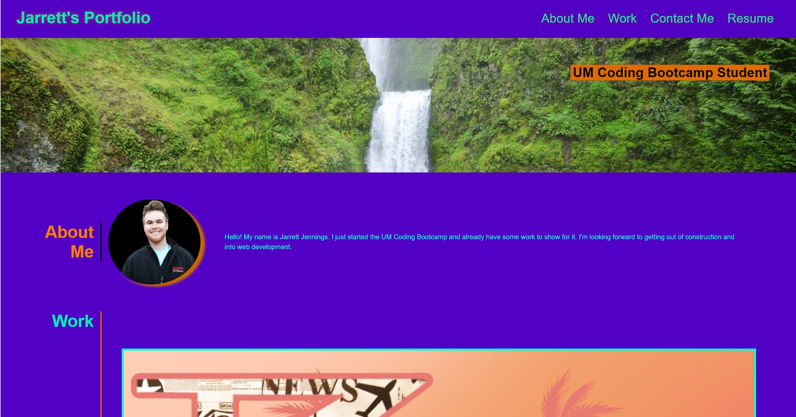
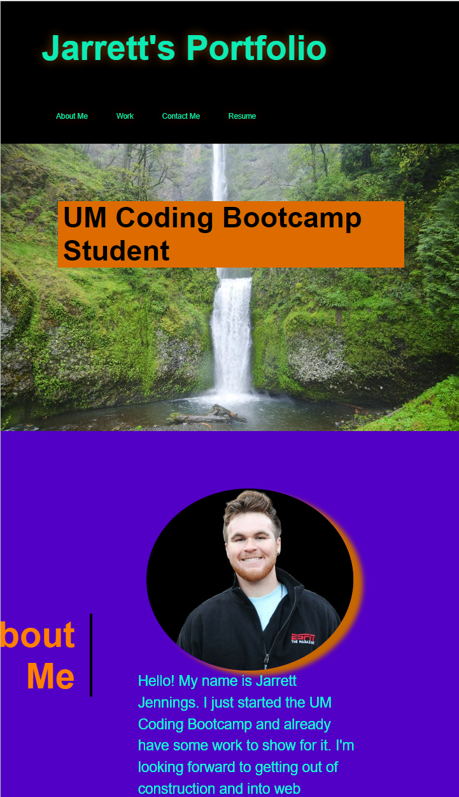

# Module 2 Advanced CSS Challenge: Professional Portfolio

## Description

This project entailed building a sample of a portfolio to display work and give a background for yourself using HTML and CSS. With this site, I will be able to actively add to my personal portfolio throughout the class, which will showcase my skills for potential employers.

## Usage

Visit the different sections of the website using the navigation bar located at the top right of the page. The Resume link will send you to my LinkedIn profile.

You can hover over the title of my projects under my work section to visit the deployed site and see how the code works! 

Feel free to contact me using the information under the contact me section. Clicking on the phone number will automatically take you to your default phone application with my phone number pre-dialed. The email will open up your default email application addressed to my email address. The GitHub link will take you to my GitHub profile. 

The webpage is responsive to screen size and will change to fit the screen of a tablet or phone. Checkout my little surprise in changing the background color for my header and footer when using a mobile screen!

### Desktop Screen

### Mobile Screen

Link to deployed webpage: https://codingjarrett.github.io/bootcampchallenge2/

## License

Please refer to the GitHub Repository for licensing information.
Link to GitHub repository: https://github.com/codingjarrett/bootcampchallenge2
